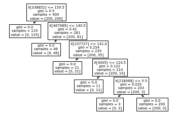

# Stolen Model

Files Provided:
- [AgentSloth.png](./AgentSloth.png)
- [model.pickle](./model.pickle)

## Description
Agent Sloth has exfiltrated APOCALYPSE's facial recognition model guarding their HQ. Agent Sloth wants to disguise himself to sneak into the HQ, however their backup security system will detect if too many changes are made to a face.

The facial recognition model reads the RGB image as a 3d array of dimensions 3*400*400 (channels first) before flattening it (np.ndarray.flatten) to a 1d array in row-major (C-style) order.

By making not more than 5 changes, help Agent Sloth to bypass the APOCALYPSE's security system!

Note: Given a 3*5*5 image, there are 75 discrete values. Changing any one of these constitutes a change.


## How we attempted

Firstly, we opened up the model, using `pickle`. This is done as follows:

```py
import pickle
model = pickle.load(open('model.pickle', 'rb'))
```

Note that if you check the type of the model, we find that it is a `DecisionTreeClassifier` from sklearn.

To represent a `DecisionTreeClassifier`, we use `sklearn.treee.plot_tree`, and true enough we get a graph of the flow of the model.

```py
from sklearn import tree
tree.plot_tree(model)
plt.show()
```



We will get back to this after a quick word from our sponsor.


There are 3 key details to note from the description:
- RGB Image
- Colour Channels taken in first
- `np.ndarray.flatten` (Row-Major is by Default)

So firstly, we use `opencv-python` (installed using `pip install`) to access the image.


```py
img = cv2.imread("AgentSloth.png")
```

However, since we want an RGB image, we must flip the last dimension. This is because OpenCV used BGR convention to read images.

```py
img = img[:,:,::-1]
```

If you now try `matplotlib.pyplot.imshow` on this imag, you get:


From here, we are required to transpose the dimensions so that the colour channels are in front. This can be done with `np.ndarray.transpose`.

```py
img = img.transpose((2, 0, 1))
```

Note that `(2, 0, 1)` represents the axes rearrangements, so `(0,1,2)` would give back the img as it is, but by bringing `2` forward, we have brought the colour channels foward.

Next, we flatten this image, and store it in an `im` variable:

```py
im = img.flatten()
```

If we now test this against the model, we get class `2` as expected:

```py
>> model.predict(im.reshape(1, -1))[0]
2
```

Which is the undesired class.

Looking at the decision tree once again, we note that only some of the values are incorrect. **5** specifically. All of them appear to be too small.

So why not just set all of them to 255?

We are granted up to 5 changes after all.

To access these values, we consider the `feature_importances_` of the models. If the feature is crucial, such as there 5, they would have a non-zero value for this variable. Thus we use `np.ndarray.nonzero` to get the indices of the crucial values. Then, we just set these values to `255`.

```py
>> im[model.feature_importances_.nonzero()] = 255
>> model.predict(im.reshape(-1,1))[0]
1
```

From here, we can reshapee the `im` variable back to the original size and write it to a file.

```py
img_new = im.reshape((3, 400, 400)).transpose((1,2,0))[:,:,::-1]
cv2.imwrite("AgentSloth2.png", img_new)
```

And that's about it.